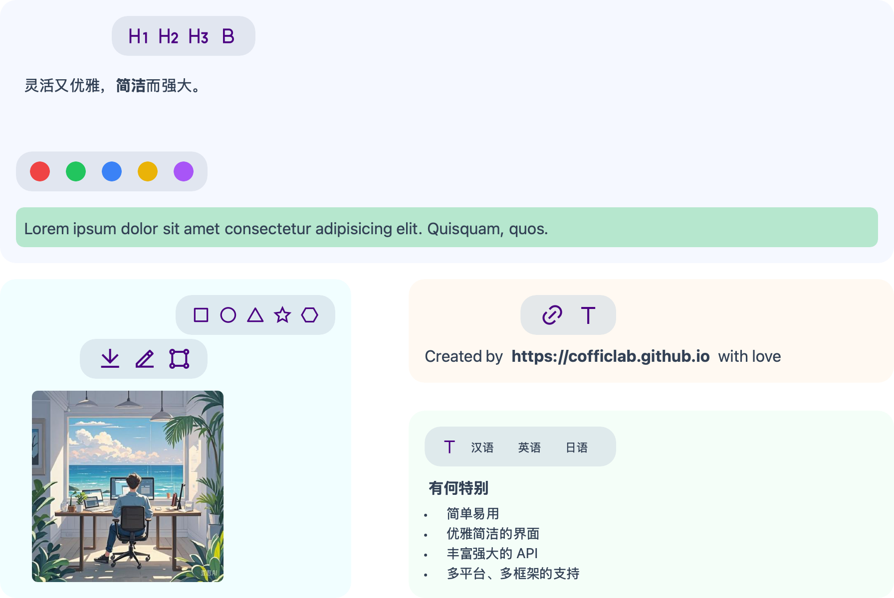

# JuiceEditor-Draw



## Important

This project cannot work independently. It is an extension package for JuiceEditor.

Please read the JuiceEditor documentation first: [JuiceEditor](https://cofficlab.github.io/en/juiceEditor/documents/components/image.html#draw-a-picture)

## Installation

1. Install package:

   ```bash
   npm i @coffic/juice-editor
   npm i @coffic/juice-editor-draw
   ```

2. Copy components to project directory:

   ```bash
   rm -rf ./public/draw
   cp -rf node_modules/@coffic/juice-editor-draw/dist ./public/draw
   ```

3. Configure editor:

   ```typescript
   editor.setDrawLink('http://localhost:5173/drawio/webapp/index.html?');
   ```

## Related Projects

- [JuiceEditor](https://github.com/CofficLab/JuiceEditor)
- [JuiceEditor-Draw](https://github.com/CofficLab/JuiceEditor-Draw)
- [JuiceEditor-SwiftUI](https://github.com/cofficlab/JuiceEditor-SwiftUI)
- [JuiceEditor-Examples](https://github.com/cofficlab/JuiceEditor-Examples)
- [JuiceEditor-Playground](https://github.com/cofficlab/JuiceEditor-Playground)

## Contributing

Contributions are welcome! Please submit Pull Requests or report issues.

## License

This project is licensed under the MIT License.

## Maintainers

Work for Joy & Live for Love ➡️ <https://github.com/nookery>
